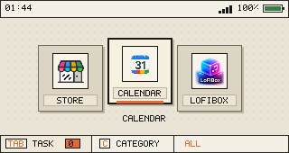

# cardputer-zero-shell

`cardputer-zero-shell` is the post-login GUI shell for Cardputer Zero.

It runs after `cardputer-zero-os` has authenticated a real Linux user and
started the internal-screen Wayland session. It is not an OS profile, not a
greeter, not a display manager, and not a privilege boundary. Its job is to show
the Zero launcher, scan APPLaunch desktop entries, launch windowed apps, and
present compositor task state on the 320x170 internal screen.

## Current UI



The screenshot is from the device runtime. ZeroShell does not ship fake menu
items. An app appears only when its package installs a desktop entry under the
APPLaunch directory.

## Architecture

The internal screen is managed through the standard Linux graphics stack:

```text
authenticated Linux user
  -> cardputer-zero-session
  -> labwc on the Cardputer Zero internal DRM output
  -> /opt/cardputer-zero-shell/bin/zero-shell-wayland
  -> Wayland or Xwayland app windows
```

There is one supported runtime binary:

```text
/opt/cardputer-zero-shell/bin/zero-shell-wayland
```

ZeroShell is a Wayland client. It draws through Wayland shared-memory buffers
and consumes compositor task state through `zero-window-agent`, which is started
by `cardputer-zero-os` inside the same labwc session. Display ownership, focus,
minimize, close, stacking, and app windows belong to the compositor layer.

## Boundary

`cardputer-zero-os` owns:

- internal DRM/KMS display setup,
- greetd/PAM/logind login,
- labwc session startup,
- global `Tab` and `Esc` input policy,
- polkit agent and privileged helper policy,
- udev and group permissions,
- HDMI/LightDM recovery policy.

`cardputer-zero-shell` owns:

- launcher UI,
- APPLaunch desktop-entry scanning,
- category filtering from desktop-entry `Categories=`,
- non-blocking app launch,
- running badges,
- task list display,
- task activation requests.

Applications own their own windows and domain UI. A launchable app must create a
Wayland or Xwayland window so labwc can manage it as a task.

## Runtime Timing

```text
greetd/PAM authenticates an existing Linux user
  -> cardputer-zero-session
  -> cardputer-zero-labwc-session
  -> labwc starts on /dev/dri/cardputer-zero-internal
  -> labwc starts cardputer-zero-shell-session
  -> cardputer-zero-shell-session starts zero-window-agent
  -> cardputer-zero-shell-session execs zero-shell-wayland
  -> ZeroShell scans /usr/share/APPLaunch/applications/*.desktop
  -> user selects an app and presses Enter
  -> ZeroShell launches Exec without blocking the launcher
  -> the app creates a Wayland/Xwayland toplevel
  -> labwc manages the window
  -> ZeroShell shows running state from compositor toplevels
```

Global task controls are mediated by `cardputer-zero-os`:

```text
Tab
  -> labwc keybind calls zero-shell-control tasks
  -> ZeroShell toggles RUNNING TASKS

short Esc
  -> zero-key-policy calls zero-shell-control minimize-active
  -> labwc minimizes the active toplevel
  -> ZeroShell is focused

long Esc
  -> zero-key-policy calls zero-shell-control close-active
  -> labwc asks the active toplevel to close
  -> ZeroShell is focused
```

This is a Wayland rule, not an implementation preference: when another app has
keyboard focus, ZeroShell cannot reliably receive global key events by itself.

## Application Contract

ZeroShell scans exactly:

```text
/usr/share/APPLaunch/applications/*.desktop
```

It intentionally does not scan `/usr/share/applications`, because normal Linux
desktop entries are not necessarily usable on the Cardputer Zero internal
screen.

Minimal entry:

```ini
[Desktop Entry]
Name=LoFiBox
Exec=lofibox
TryExec=lofibox
Icon=share/images/lofibox.png
Categories=Audio;Player;
X-Zero-Display=xwayland
StartupWMClass=lofibox
```

Supported fields:

| Field | Meaning |
| --- | --- |
| `Name` | Display name. |
| `Exec` | Command launched by ZeroShell. |
| `Icon` | Icon path. Relative `share/...` paths resolve under `/usr/share/APPLaunch`. |
| `Categories` | Desktop-entry categories used by the launcher category drawer. |
| `TryExec` | Hide the entry when the command is unavailable. |
| `X-Zero-ShortName` | Optional short launcher label. |
| `StartupWMClass` | Xwayland/X11 matching hint. |
| `X-Zero-AppId` | Wayland app id matching hint. |
| `X-Zero-Display` | Required runtime display contract: `wayland` or `xwayland`. |

`X-Zero-Display` must be either:

```ini
X-Zero-Display=wayland
```

or:

```ini
X-Zero-Display=xwayland
```

Entries without one of those values are not launched by this shell.

The launcher category drawer filters apps only through `Categories=` values.
`All` is always present and means no filter. Apps without a usable category are
shown under `Other`.

## Task Model

In this shell, a task is a compositor-managed toplevel/window.

A task is not primarily:

- a PID,
- a child process,
- a process group,
- a shell wrapper,
- a desktop-entry file.

Those can help with launch and matching, but the task exists when labwc can see
a window and `zero-window-agent` reports it over:

```text
/run/user/$UID/cardputer-zero/window-agent.sock
```

The socket speaks the `ZWA1` protocol defined by `cardputer-zero-os`. ZeroShell
uses it for:

- task snapshots,
- running badges,
- task-panel contents,
- task activation requests.

ZeroShell must not parse command-line compositor output, scan `/proc`, or treat
launched child processes as tasks. If the agent is unavailable, ZeroShell shows
an explicit offline task backend state instead of guessing.

## User Controls

Home:

| Key | Behavior |
| --- | --- |
| `Left` / `Right` | Select app. |
| `Enter` | Launch selected app, or focus it if already running. |
| `C` | Toggle category drawer and filter apps by `Categories=`. |
| `Tab` | Toggle running task panel. |
| `R` | Reload APPLaunch entries. |

Category drawer:

| Key | Behavior |
| --- | --- |
| `Up` / `Down` | Select category and immediately filter apps. |
| `Left` / `Right` | Select category and immediately filter apps. |
| `Enter` | Keep selected category and close the drawer. |
| `C` / `Esc` | Hide category drawer. |

Running task panel:

| Key | Behavior |
| --- | --- |
| `Up` / `Down` | Select task. |
| `Enter` | Focus selected task through labwc. |
| `Tab` / `Esc` | Hide task panel. |

Global app policy:

| Key | Behavior |
| --- | --- |
| Short `Esc` | Minimize active app window and return to ZeroShell. |
| Long `Esc` | Request close on active app window and return to ZeroShell. |

## File Map

| File | Role |
| --- | --- |
| `CMakeLists.txt` | Builds `zero-shell-wayland` and generates xdg-shell protocol code. |
| `install.sh` | Builds and installs `zero-shell-wayland`; creates APPLaunch data directories. |
| `uninstall.sh` | Removes the installed shell binary. |
| `main/include/zero_shell/app_catalog.hpp` | Defines APPLaunch entry metadata used by the Wayland shell. |
| `main/src/app_catalog.cpp` | Parses APPLaunch `.desktop` files, applies `TryExec`, and resolves metadata. |
| `main/include/zero_shell/image.hpp` / `main/src/image.cpp` | PNG loading for launcher icons. |
| `main/include/zero_shell/status.hpp` / `main/src/status.cpp` | Reads time, WiFi, and battery status. |
| `main/src/zero_shell_wayland.cpp` | Wayland UI, non-blocking launch, running badge, task list, and command-file handling. |

## Build

Required packages on the target:

```sh
sudo apt-get install build-essential cmake pkg-config libpng-dev \
  libwayland-dev wayland-protocols
```

Build:

```sh
cmake -S . -B build
cmake --build build
```

Output:

```text
build/zero-shell-wayland
```

`install.sh` can compile directly when CMake is unavailable, but the Wayland
build still needs `wayland-scanner`, `xdg-shell.xml`, `libpng`, and
`libwayland-client`.

## Install

```sh
sudo ./install.sh
```

Installs:

```text
/opt/cardputer-zero-shell/bin/zero-shell-wayland
/usr/share/APPLaunch/applications
/usr/share/APPLaunch/share/images
```

It does not configure systemd, greetd, PAM, LightDM, udev, users, autologin, or
app entries. Those belong to `cardputer-zero-os` or to app packages.

## Verify

Check process identity:

```sh
ps -eo user,pid,args | grep zero-shell-wayland
```

Expected shape:

```text
pi  /opt/cardputer-zero-shell/bin/zero-shell-wayland
```

Check the authoritative task backend:

```sh
python3 - <<'PY'
import socket
p = "/run/user/1000/cardputer-zero/window-agent.sock"
s = socket.socket(socket.AF_UNIX)
s.settimeout(2)
s.connect(p)
s.sendall(b"list\n")
print(s.recv(4096).decode())
PY
```

Example:

```text
cardputer-zero-shell: Cardputer Zero Shell
lofibox: LoFiBox Zero
```

## Documentation Index

- [docs/intent.md](docs/intent.md)
- [docs/relationship-to-os.md](docs/relationship-to-os.md)
- [docs/application-contract.md](docs/application-contract.md)
- [docs/runtime.md](docs/runtime.md)
- [docs/spec.md](docs/spec.md)
- [docs/user-guide.md](docs/user-guide.md)
- [docs/wayland-task-model.md](docs/wayland-task-model.md)
- [docs/window-agent-task-backend.md](docs/window-agent-task-backend.md)
- [docs/install.md](docs/install.md)
- [docs/development.md](docs/development.md)
